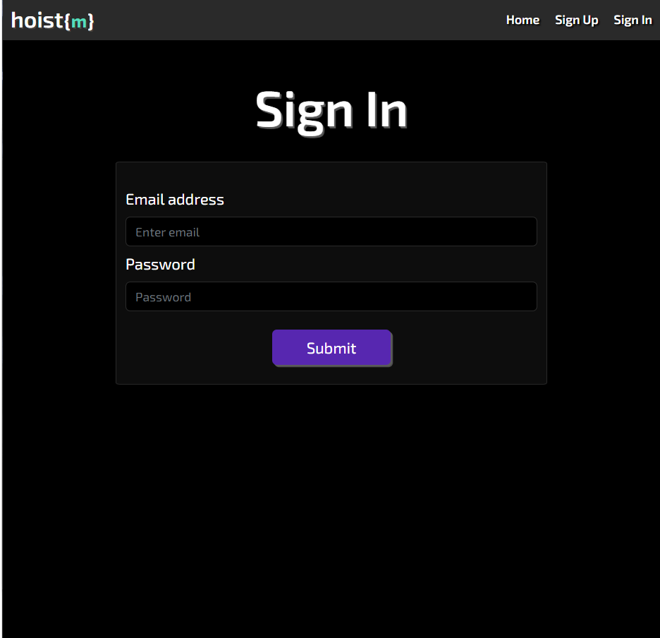
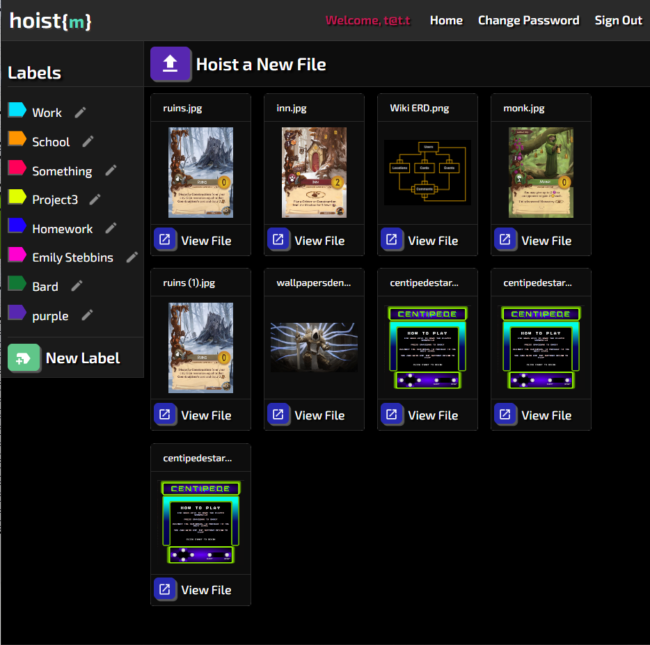
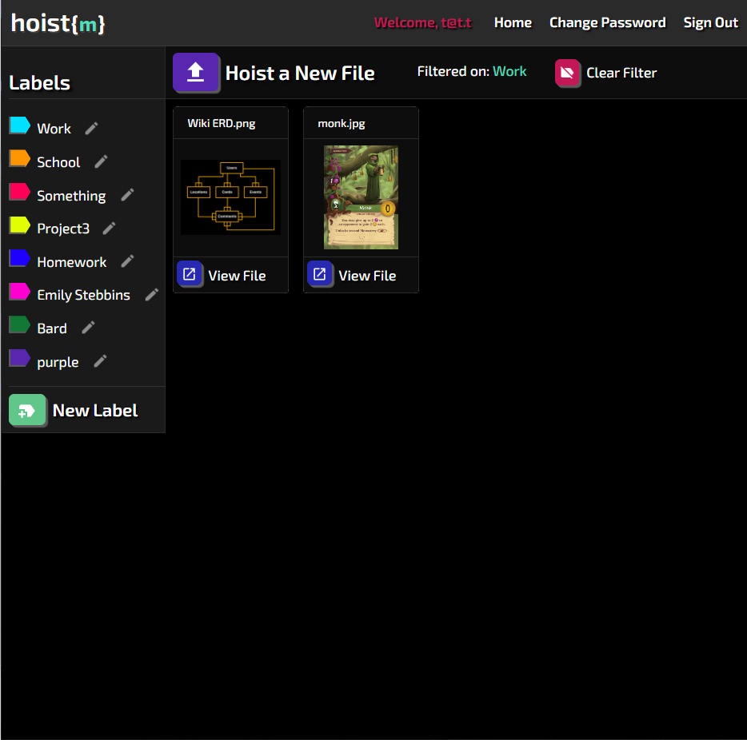
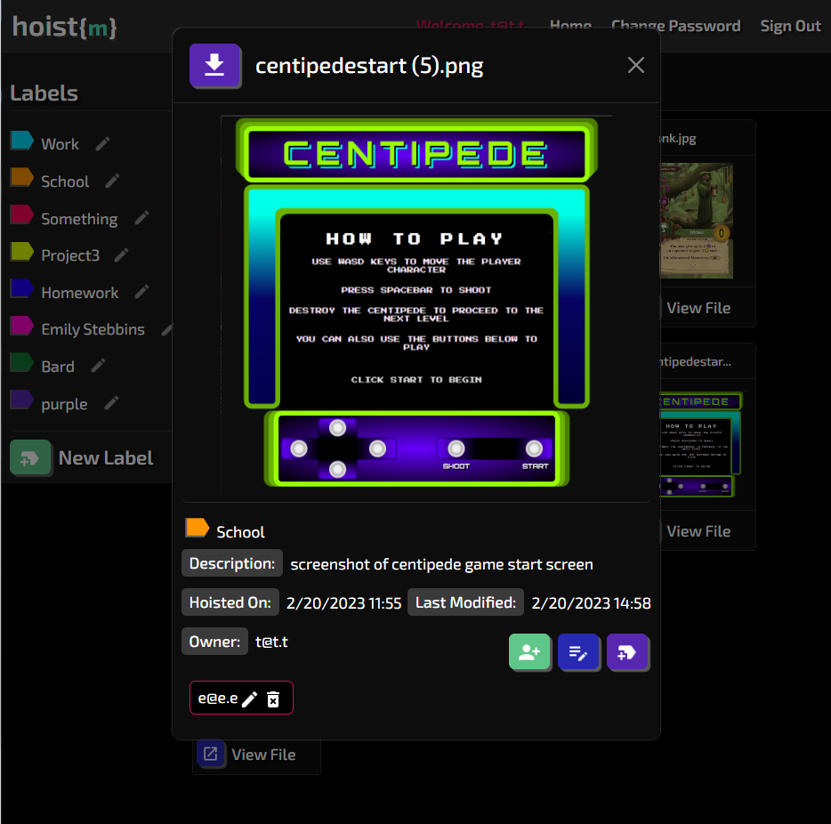
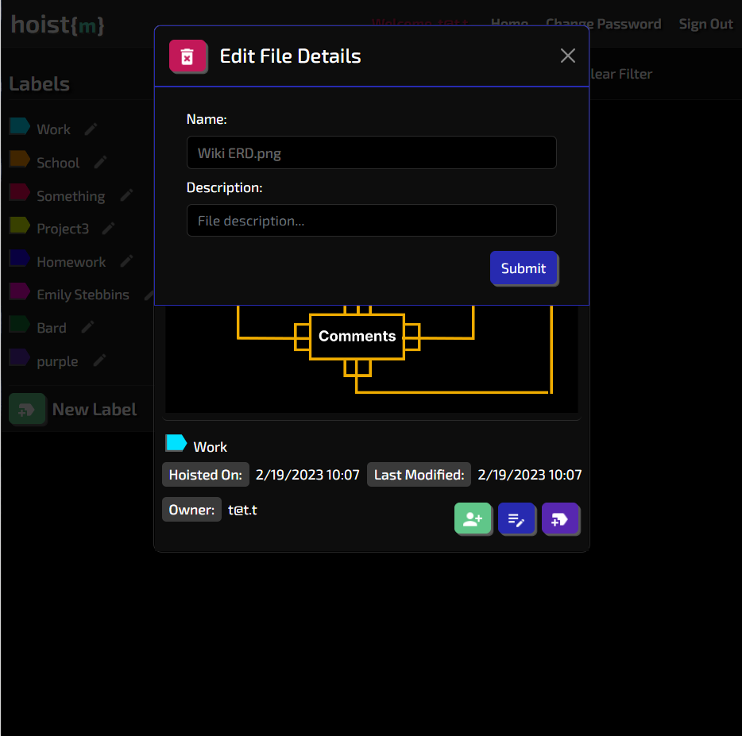
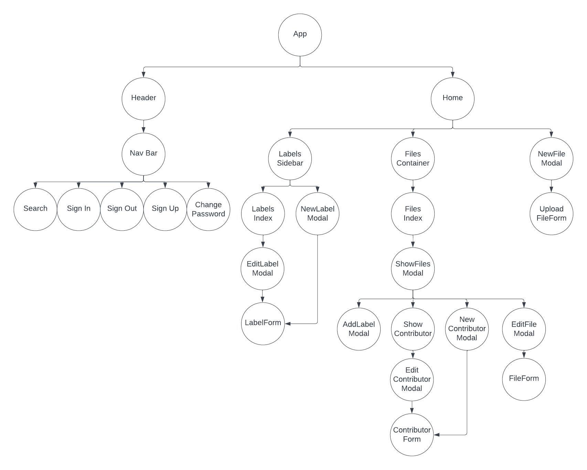

# hoist{m}
Creators: Malcolm Kemp, Jordan Rector, Emily Stebbins

## Full-stack Application Project
This is the client that consumes the hoist{m} API: https://github.com/estebbins/hoistm-api

Project requirements: https://github.com/estebbins/hoistm-api#project-requirements

Project planning documentation: https://github.com/estebbins/hoistm-api#project-planning 

## Overview
This app allows users to upload files into a virtual file system where the user can save and download their files. Users can create custom labels as the singular & simple method for file organization. This is a full-stack MERN app using AWS S3 cloud storage and Multer middleware for file upload. This app features user authentication, encryption for file uploads, and allows for file owners to control contributor access and rights.

### Technologies Used:
- Mongoose
- MongoDb
- Express
- Morgan
- Postman
- bcryptjs
- Reactjs
- AWS S3
- Axios
- JavaScript
- Bootstrap
- React Bootstrap
- Multer - "node.js middleware for handling multi-part/form-data, which is primarily used for uploading files" [^10]
    - Adds a body object and file(s) object to request body
    - **Must use** enctype="multipart/form-data" in forms
- packages: Node, Nodemon, dotenv, method-override, express-session, connect-mongo

## User stories
- As an unregistered user, I would like to sign up with email and password.
- As a registered user, I would like to sign in with email and password.
- As a signed in user, I would like to change password.
- As a signed in user, I would like to sign out.
- As a signed in user, I would like to upload a file to AWS with a name.
- As a signed in user, I would like to update the name of my file on AWS and add/edit its description.
- As a signed in user, I would like to see the all my uploaded files on AWS.
- As a signed in user, I would like to see the preview of all files on AWS.
- As a signed in user, I would like to delete the reference of my file from the database.
- As a signed in user, I would like to see the following data for any file:
    - date created/uploaded
    - date modified
    - owner (user who uploaded the file)
    - name
    - description
    - contributors attached
    - labels associated
- As a signed in user, I would like to be able to create and associate custom labels to files
- As a signed in user, I would like to download files from AWS
- As a signed in user, I would like to filter my files based on custom labels

## Wireframes/Screenshots (J)

#### Sign Up

#### Home

#### Label Filter

#### Show File Modal

#### Edit File Modal

## Component Diagram

### Stretch Goals
- Calendar invites with files attached
- PDF Conversion (API)
- Temporary file-sharing link (to preserve space)
- Collaborators can access files with appropriate permission level

## Approach taken
- Our team wanted to learn more about AWS and decided to take on a file storage application as our MERN project.

## Installation instructions
**Using the application**

## Unsolved problems
-.dmg files will upload successfully but can not be downloaded, attempt of download of such a file type will result in a fatal error that will crash app.   

## Media sources
- Icons: https://fonts.google.com/icons?icon.set=Material+Icons
